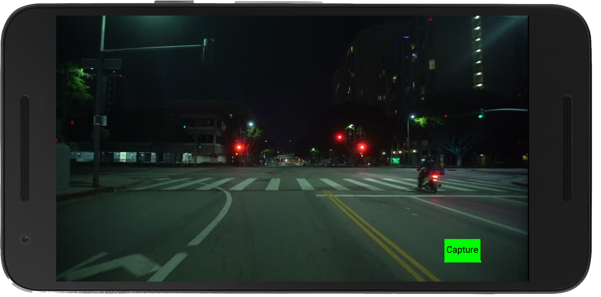

# Multi-Sensor Grabber

App that is able to grab videos (in form of image-frames) that are annotated with
* GPS
* Accelerometer
* Gyroscope
* Timestamp
to create low-cost, mobile sequence capturing devices.

## Currently implemented
* cquire rights (camera, gps, etc.)
* Fullscreen app with overlayed button start/stop capturing
* Getting and setting desired image resolution
* Saving of image frames every 100ms

## TODO
* ~~Settings Activity?~~
* ~~choose framerate (and implement)~~
* ~~gps grabbing~~
* accel/gyro grabbing
* Saving: ~~xml~~/sqlite ?
